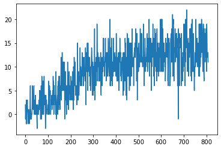

# Algorithm
The code implements a Double Deep Q Learning algorithm with Prioritized Action Replay.

## Network Architecture
The neural network uses a Dueling Deep Q Learning architecture. It starts off with a layer of 150 neurons followed with a lyer of 50 neurons.
It then splits into two, using a layer of 50 neurons to estimate the advantages, and a similar layer to estimate the value. All layers use a relu activation,
except for the final advantage and value layers which use a linear activation.

# Hyperparameters
Learning Rate: 0.001, getting multiplied by 0.998 every episode
Update Frequency: Every 4 steps
Update Batch Size: 16
Epsilon: 0.3, minus 0.003 every episode
### Experience Action Replay

&alpha;: 0.9

&beta;: 0.6, plus 0.003 every episode until equal to 1

# Learning

The agent took ~800 episodes to solve the environment. As shown in the graph below, 
the reward increased quickly at first, then proceeded to plateau, though it probably could continue to learn
had it kept running.

# Ideas for future work
The hyperparameters in the code could be further tuned to improve the speed of the learning, as well as the maximum score. 
The program could also be run longer as when it was tested, it was stopped as soon as the environment was solved.

Finaly, the agent could possibly benefit from using a Rainbow DQN, as used in this paper: https://arxiv.org/pdf/1710.02298.pdf  
Since the Rainbow DQN preformed much better on Atari games, it is possible that it can show an improvement in this environment.
