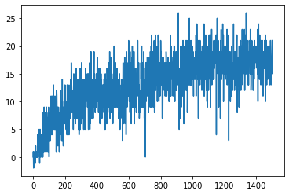

# Algorithm
The code implements a Double Deep Q Learning algorithm with Prioritized Experience Replay. 

## Deep Q Learning
Deep Q Learning is based upon the Q function, a function that returns the reward an agent will earn assuming it takes the ideal action at every single state till the end of the game. If an agent knew the exact Q Value for every single state in an environment, it would be able to find the optimal policy for said environment. However, since the exact Q Function is almost always not known, the agent has to rely on using a neural network to create an estimate. By using an estimate for the Q Function, the agent can predict the Q Value for every action it can take at a given state. By taking the action with the highest Q Value, the Agent can find the optimal algorithm.

Deep Q Learning uses the loss function shown below to update itself.

## Epsilon Greedy Algorithm
While the best action to take should be the one with the highest predicted Q Value, this is not always true. The neural network is only creating an estimate after all, there is no guarantee this estimate is correct, or even close. The agent has to be able to explore the environment in order it to get a usable estimation. That is why we use the Epsilon Greedy Algorithm. Instead of always taking the action with the highest predicted Q Value at each state, the agent sometimes takes a random action. This ensures that the agent can fully explore the environment and train its Q Function estimate to be as close as possible to the actual function.

## Experience Replay
In order for the neural network to train, it must have information from past states and rewards to learn from. This is all stored in the Experience Replay. Every few timesteps, the neural network trains itself using its memory by using the Bellman Equation I mentioned above.

Prioritized Experience Replay works by making some memories more likely to be learned from than others. If the Q Network had a high loss when training on a certain sample, that sample will be given a higher priority than one which has a lower loss.

## Target Q Network
One major problem with regular Deep Q Learning is that in the Bellman Equation, the next state's Q Value keeps changing as the current Q Function estimator keeps being updated. This severly impacts training because it can be extremely difficult for the Q Network to ever converge. To solve this, a Target Q Network is used. The Target Q Network is just a copy of the Q Network which usually stays constant, just occationaly coppying the Q Network's weights. By using this to estimate the next state's Q Value in the Bellman Equation, it is now easier for the current Q Network to converge since it is not chasing a constantly moving target.

## Network Architecture
The neural network uses a Dueling Deep Q Learning architecture. It starts off with a layer of 150 neurons followed with a lyer of 50 neurons.
It then splits into two, using a layer of 50 neurons to estimate the advantages, and a similar layer to estimate the value. All layers use a relu activation,
except for the final advantage and value layers which use a linear activation.

# Hyperparameters
Learning Rate: 0.001, getting multiplied by 0.998 every episode
Update Frequency: Every 4 steps
Update Batch Size: 16
Epsilon: 0.3, minus 0.003 every episode
### Experience Action Replay

&alpha;: 0.9

&beta;: 0.6, plus 0.003 every episode until equal to 1

# Learning

The agent took ~800 on average episodes to solve the environment(Example shown in graph took 741 episodes). As shown in the graph below, 
the reward increased quickly at first, then proceeded to plateau, though it likely could have continued to improve its score
had it kept learning

# Ideas for future work
The hyperparameters in the code could be further tuned to improve the speed of the learning, as well as the maximum score. 
The program could also be run longer as when it was tested, it was stopped as soon as the environment was solved.

Finaly, the agent could possibly benefit from using a Rainbow DQN, as used in this paper: https://arxiv.org/pdf/1710.02298.pdf  
Since the Rainbow DQN preformed much better on Atari games, it is possible that it can show an improvement in this environment.
